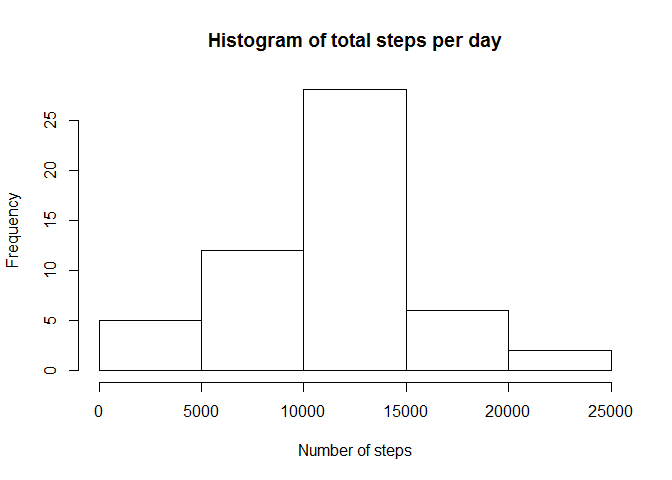
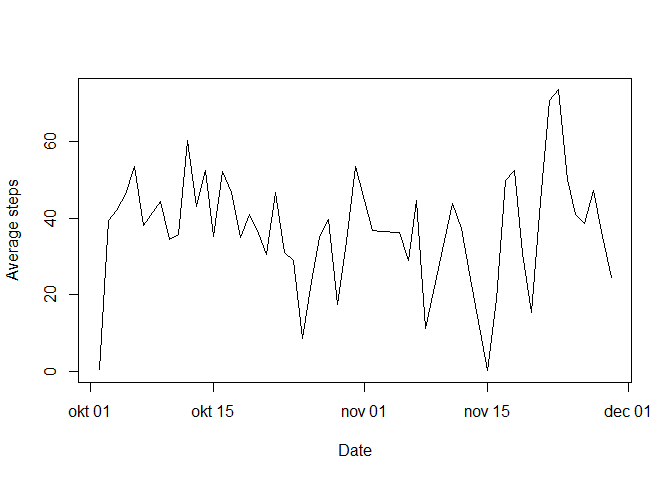
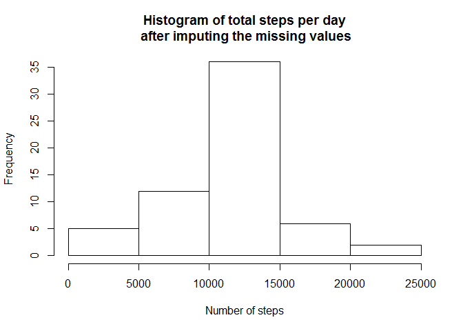
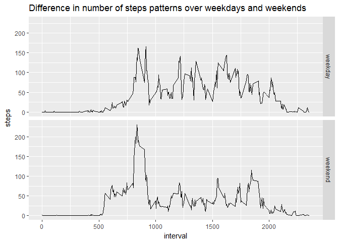

Loading and preprocessing the data
----------------------------------

``` r
#(1) Loading the data
urlfile <- "https://d396qusza40orc.cloudfront.net/repdata%2Fdata%2Factivity.zip"
zipfile <- "activitydata.zip"
download.file(urlfile, zipfile)
filename <- unzip(zipfile = zipfile)
activities <- read.csv(filename,na.strings = "NA")

#(2) Preprocessing for different questions
library(lubridate)
```

    ## 
    ## Attaching package: 'lubridate'

    ## The following object is masked from 'package:base':
    ## 
    ##     date

``` r
meanactivities <- aggregate(steps ~ date, activities, mean)
meanactivities$date <- ymd(meanactivities$date)
activitiestotal<-aggregate(steps~interval,activities,sum)
```

What is mean total number of steps taken per day?
-------------------------------------------------

``` r
#(1) Calculating the total steps per day
totalactivities <- aggregate(steps ~ date, activities, sum)
#(2) Histogram of the total steps taken each day
hist(totalactivities$steps,
     main="Histogram of total steps per day",
     xlab= "Number of steps")
```



``` r
#(3) Calculate and report the median and mean of total number of steps per day  
summary(totalactivities$steps)
```

    ##    Min. 1st Qu.  Median    Mean 3rd Qu.    Max. 
    ##      41    8841   10760   10770   13290   21190

What is the average daily activity pattern?
-------------------------------------------

``` r
#(1) Time series plot (type="l") of the interval and the average steps taken
with(meanactivities,plot(date,steps,type="l",xlab="Date",ylab="Average steps"))
```



``` r
#(2) The interval which contains the maximum number of steps
activitiestotal[activitiestotal$steps == max(activitiestotal$steps),]
```

    ##     interval steps
    ## 104      835 10927

Imputing missing values
-----------------------

``` r
#(1) Number of rows with missing values (incomplete cases) 
comp<-complete.cases(activities)
nrow(activities[!comp,])
```

    ## [1] 2304

``` r
#(2) Define a strategy to impute the missing values
# Looking at the data, I see 8 days where for all intervals the data is missing.
# This makes me conclude that only a mean of the interval leads to a straightforward 
# impution that seems logical.
# Since the steps are in integer, I take the floor of the mean
means<-floor(aggregate(steps ~ interval,activities,mean)) 
# I merge the 2 steps to compare them easier
activities_m<-merge(activities,means,by="interval")
activities_m<-transform(activities_m,steps=steps.x,stepsmean=steps.y)
library(sqldf)
```

    ## Loading required package: gsubfn

    ## Loading required package: proto

    ## Warning: package 'proto' was built under R version 3.3.2

    ## Loading required package: RSQLite

    ## Loading required package: DBI

``` r
# I do the replacement after all with SQL since it's there the most straightforward to me.
#(3) Create a new dataset with the missing data filled in
activities.c<-sqldf('select case when steps is NULL then stepsmean else steps end steps, date, interval from activities_m')
```

    ## Loading required package: tcltk

``` r
#(4) Make a new histogram with the new dataset
totalactivities.c <- aggregate(steps ~ date, activities.c, sum)
hist(totalactivities.c$steps,
     main="Histogram of total steps per day\n after imputing the missing values",
     xlab= "Number of steps")
```

 The number are higher in the new histogram compared to the old one, but the spread is more or less the same. This means that the impact of imputing the missing data is minimal at first glance.

Are there differences in activity patterns between weekdays and weekends?
-------------------------------------------------------------------------

``` r
#(1) Create a new factor variable with a "weekday" and a "weekend" level
library(timeDate)
```

    ## Warning: package 'timeDate' was built under R version 3.3.2

``` r
activities.c$weekpart<-as.factor(ifelse(isWeekend(activities.c$date),"weekday","weekend"))
#(2) Make a panel plot (type="l") of the interval and averarge steps taken across weekday and weekend days
library(ggplot2)
#activities.c.mean<-aggregate(steps~c(interval,weekpart),activities.c,mean)
activities.c.mean<-sqldf('select interval,weekpart,avg(steps) steps from \"activities.c\" group by interval,weekpart')
g<-ggplot(activities.c.mean,aes(interval,steps))
g<-g+geom_line()
g<-g+facet_grid(weekpart~ .)
g<-g+ggtitle("Difference in number of steps patterns over weekdays and weekends")
g
```



For completeness and make it better reproducible, here is the session\_info from devtools for this session:

    ## Warning: package 'devtools' was built under R version 3.3.2

    ## Session info --------------------------------------------------------------

    ##  setting  value                       
    ##  version  R version 3.3.1 (2016-06-21)
    ##  system   x86_64, mingw32             
    ##  ui       RTerm                       
    ##  language (EN)                        
    ##  collate  Dutch_Netherlands.1252      
    ##  tz       Europe/Berlin               
    ##  date     2016-11-12

    ## Packages ------------------------------------------------------------------

    ##  package    * version  date       source        
    ##  assertthat   0.1      2013-12-06 CRAN (R 3.3.1)
    ##  chron        2.3-47   2015-06-24 CRAN (R 3.3.1)
    ##  colorspace   1.3-0    2016-11-10 CRAN (R 3.3.1)
    ##  DBI        * 0.5-1    2016-09-10 CRAN (R 3.3.1)
    ##  devtools   * 1.12.0   2016-06-24 CRAN (R 3.3.2)
    ##  digest       0.6.10   2016-08-02 CRAN (R 3.3.1)
    ##  evaluate     0.10     2016-10-11 CRAN (R 3.3.1)
    ##  ggplot2    * 2.2.0    2016-11-11 CRAN (R 3.3.1)
    ##  gsubfn     * 0.6-6    2014-08-27 CRAN (R 3.3.1)
    ##  gtable       0.2.0    2016-02-26 CRAN (R 3.3.1)
    ##  htmltools    0.3.5    2016-03-21 CRAN (R 3.3.1)
    ##  knitr        1.15     2016-11-09 CRAN (R 3.3.2)
    ##  labeling     0.3      2014-08-23 CRAN (R 3.3.1)
    ##  lazyeval     0.2.0    2016-06-12 CRAN (R 3.3.1)
    ##  lubridate  * 1.6.0    2016-09-13 CRAN (R 3.3.1)
    ##  magrittr     1.5      2014-11-22 CRAN (R 3.3.1)
    ##  memoise      1.0.0    2016-01-29 CRAN (R 3.3.1)
    ##  munsell      0.4.3    2016-02-13 CRAN (R 3.3.1)
    ##  plyr         1.8.4    2016-06-08 CRAN (R 3.3.1)
    ##  proto      * 1.0.0    2016-10-29 CRAN (R 3.3.2)
    ##  Rcpp         0.12.7   2016-09-05 CRAN (R 3.3.1)
    ##  reshape2     1.4.2    2016-10-22 CRAN (R 3.3.1)
    ##  rmarkdown    1.1      2016-10-16 CRAN (R 3.3.2)
    ##  RSQLite    * 1.0.0    2014-10-25 CRAN (R 3.3.1)
    ##  scales       0.4.1    2016-11-09 CRAN (R 3.3.2)
    ##  sqldf      * 0.4-10   2014-11-07 CRAN (R 3.3.1)
    ##  stringi      1.1.2    2016-10-01 CRAN (R 3.3.1)
    ##  stringr      1.1.0    2016-08-19 CRAN (R 3.3.1)
    ##  tibble       1.2      2016-08-26 CRAN (R 3.3.1)
    ##  timeDate   * 3012.100 2015-01-23 CRAN (R 3.3.2)
    ##  withr        1.0.2    2016-06-20 CRAN (R 3.3.1)
    ##  yaml         2.1.13   2014-06-12 CRAN (R 3.3.1)
